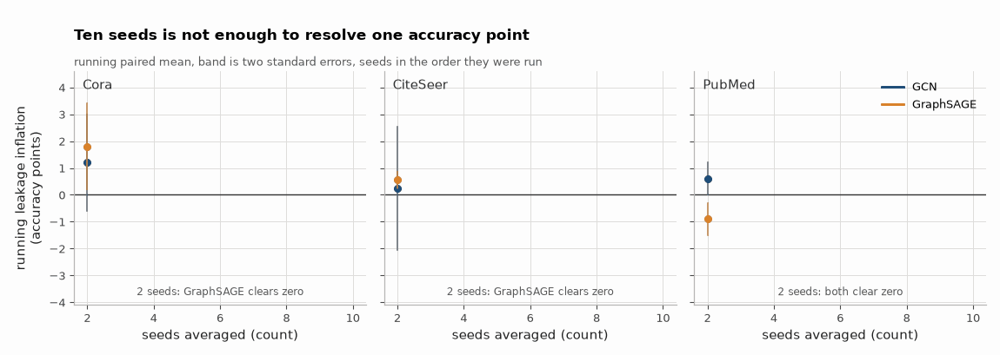

# LeakGraph

**How much accuracy does transductive evaluation add on standard GNN node-classification benchmarks, and where does it come from?**

---

## Abstract

Transductive node classification evaluates a model on nodes that were present in
the graph it trained on. The standard concern is that this leaks. This work
measures the size of that leak on five benchmarks and four models under one
protocol: identical splits, seeds, initialisation and epoch budget, differing
only in whether the test nodes existed in the training graph. The difference is
taken per seed and then averaged, so shared initialisation noise cancels.

Inflation is real on the homophilous citation graphs and small, at most 1.5
accuracy points, on Cora with GraphSAGE. On the two heterophilous graphs it
reverses: GCN *loses* 2.5 points to the transductive split. LabelProp and MLP
read exactly zero everywhere, which is the instrument check rather than a result,
since neither can distinguish the two splits. Exposure and leakage turn out to be
different quantities: squirrel exposes 40% of its test nodes to a labelled
training neighbour against Cora's 21% and still inflates less, because a vote
over those labels scores 21% there against a 19% majority baseline, versus 80%
against 13% on Cora. An attempt to decompose inflation into a density term and a
test-specific term mostly fails to resolve, and is reported as failing.

**Contributions.** (i) One harness measuring duplicate, feature-label and
neighbourhood-label leakage on the same splits with the same seeds. (ii) A
headline metric, leakage inflation, comparable across datasets and models. (iii)
Negative and density-matched controls, including a random split that reads zero.
(iv) Evidence that the duplicate rate is largely a choice of definition, ranging
from 0.04% to 45% on PubMed depending which is used.

---

## 1. Scope: this is tooling, not a discovery

Every phenomenon measured here is already documented in the literature. I did not find any of
it. What this repository contributes is a single harness that measures all of it on the same
splits with the same seeds under the same protocol, a headline metric that makes the cost
comparable across datasets and models, and a test suite that checks the instrument rather than
the result. Treat it as a measuring device and a replication, not as a novel claim.

See [Prior work](#11-prior-work) for what was already known, with sources I verified before
citing them.

## 2. The headline number
Inflation is real on the homophilous citation graphs and small: 1.5 accuracy points at most, on Cora with GraphSAGE.
On the heterophilous pair the sign flips, and GCN *loses* 2.5 points on chameleon and 1.2 on squirrel by training on
a graph that already contains the test nodes. MLP and LabelProp read exactly 0.0 in every cell, which is the
instrument check and not a finding, since neither model can tell the two arms apart.

*Leakage inflation on the three citation graphs, one seed added at a time. The band is two standard errors, and it takes most of the ten seeds before the mean settles anywhere you would want to quote it.*

Full detail in [notes/METHODS.md](notes/METHODS.md#2-the-headline-number).
### What I actually found, including the parts that argue against the premise
I built this expecting transductive evaluation to be buying the GNNs a visible amount of accuracy. Mostly it is not.
Only five of the ten GNN cells resolve at two standard errors, and no resolved reading exceeds 2.5 accuracy points in
either direction. PubMed shows nothing at all for either GNN, 0.3 and 0.1 points, and re-running everything on ten
random splits leaves not one of the ten cells resolved.

Full detail in [notes/METHODS.md](notes/METHODS.md#what-i-actually-found-including-the-parts-that-argue-against-the-premise).
## 3. What the number means
An accuracy gap on its own is uninterpretable. Two baselines bound it. On Cora an MLP that never touches the graph
already scores 56.9% against the inductive GCN's 80.3%, so most of that accuracy was never graph learning. A majority
vote over a test node's training-set neighbours, with no features and no training at all, scores 79.6% on the 21% of
Cora test nodes that have such a neighbour, and the GCN scores 86.1% on that same subset.

Full detail in [notes/METHODS.md](notes/METHODS.md#3-what-the-number-means).
## 4. Is the gap actually leakage?
The random split is the negative control: it has no temporal or structural reason to leak, so a non-zero reading there would be a fault in the harness rather than a finding.
Nothing in it resolves. The stronger check is a third arm that removes the same *number* of nodes from the unlabelled
pool instead of the test set, splitting the gap into the cost of a smaller training graph and the part specific to the
test nodes. For GraphSAGE the smaller-graph term alone is 2.4 points on Cora and 2.8 on CiteSeer, both larger than the
total inflation, so almost none of that gap is leakage. Cora GCN is the one cell where inflation survives the control
roughly intact: 1.0 point total, 0.1 of it density, and a resolved test-specific 1.0.

Full detail in [notes/METHODS.md](notes/METHODS.md#4-is-the-gap-actually-leakage).
### Recovering the control where the split leaves no pool
A pool of unlabelled nodes can be manufactured out of the test set itself. Reserve half of it: those nodes keep their
features and edges, their labels are never used, and they are never scored. That makes the decomposition constructible
on chameleon and squirrel, where the geom-gcn splits label every node and leave no pool at all. Neither component
resolves on either dataset, chameleon GCN reading -0.5 density and -0.5 test-specific and squirrel GCN -0.5 and -0.7,
so the answer is that ten seeds on a halved test set cannot tell.

Full detail in [notes/METHODS.md](notes/METHODS.md#recovering-the-control-where-the-split-leaves-no-pool).
### A second split scheme
The other route is to stop using the shipped splits. Ten random Planetoid-style splits per dataset, 20 labels per
class, leave an unlabelled pool everywhere, chameleon and squirrel included. Under them not one of the ten GNN
inflation cells resolves, and the two negative GCN readings vanish: chameleon moves from -2.5 to 0.0 and squirrel from
-1.2 to 0.2. The error bars are roughly double the headline table's, because these include the split variance that a
single public split cannot show.

Full detail in [notes/METHODS.md](notes/METHODS.md#a-second-split-scheme).
## 5. Decomposing by duplicates
Adding test nodes does two things at once: it makes the graph denser, helping any node, and it exposes the test nodes' own neighbourhoods.
Scoring only test nodes with no near-duplicate twin in training moves inflation by at most 0.8 points anywhere,
squirrel included, and squirrel has 1,580 straddling pairs. Duplicates are abundant; what they contribute to *this*
gap is small. The density half of the split is not clean either, with seven of its twelve GNN components clearing two
standard errors and the test-specific term coming out negative in three of the six cells.

Full detail in [notes/METHODS.md](notes/METHODS.md#5-decomposing-by-duplicates).
## 6. The detectors
"Duplicate node" has no single meaning, and the choice dominates the answer. PubMed is 0.04% duplicated under exact
feature match and 44.6% duplicated under identical neighbour set, so any headline duplicate figure is a threshold
decision before it is a measurement. The detectors also pull exposure apart from leakage. Squirrel exposes 40% of its
test nodes to a labelled training neighbour against Cora's 21% and still inflates less, because a vote over those
labels scores 21% there against a 19% majority baseline, where the same vote on Cora scores 80% against 13%.

Full detail in [notes/METHODS.md](notes/METHODS.md#6-the-detectors).
### Duplicate and near-duplicate nodes
<!--BEGIN:duplicates-->

| dataset | nodes | exact duplicate nodes | all-zero feature rows | near-dup pairs | cutoff | straddling pairs | test nodes with a train twin |
|---|---|---|---|---|---|---|---|
| Cora | 2708 | 27 (1.0%) | 0 | 440 | 0.474 | 10 | 8 / 1000 (0.8%) |
| CiteSeer | 3327 | 35 (1.1%) | 15 | 2790 | 0.292 | 51 | 45 / 1000 (4.5%) |
| PubMed | 19717 | 7 (0.0%) | 0 | 188 | 0.904 | 1 | 1 / 1000 (0.1%) |
| chameleon | 2277 | 375 (16.5%) | 233 | 3395 | 0.378 | 683 | 128 / 456 (28.1%) |
| squirrel | 5201 | 265 (5.1%) | 165 | 7348 | 0.354 | 1580 | 377 / 1041 (36.2%) |

<!--END:duplicates-->

Two of these line up with the literature and one does not. My 1.0% exact duplicate nodes on Cora matches the 1% that
OGB quotes from Zou et al., and 16.5% on chameleon with 5.1% on squirrel is the heavy duplication Platonov et al.
report for exactly those two. CiteSeer is the one that does not: I measure 1.1% against the 5% quoted in the same
sentence as Cora's 1%. Note also how weakly duplicate abundance predicts leakage, since squirrel has the worst
straddling counts in the table and its GCN inflation is negative.

Full detail in [notes/METHODS.md](notes/METHODS.md#duplicate-and-near-duplicate-nodes).
### Trying to reconcile the CiteSeer duplicate rate
"Duplicate" is not one definition, so the disagreement might be a definitional difference rather than a conflict. `make duplicate-definitions` evaluates eighteen readings of it on all five datasets: exact feature match counted four different ways, with and without labels, with and without the all-zero rows, near-duplicates at five cosine cutoffs and three Jaccard cutoffs, and duplication defined on the graph instead of the features.
None of the eighteen reproduces both quoted figures, and the threshold is not the reason. Fourteen of them put
CiteSeer within a factor of 1.5 of Cora, where the quote needs a factor of 5, and solving directly for the cosine
cutoff that puts CiteSeer at exactly 5% gives 0.8006, at which Cora reads 3.95% rather than 1%. My CiteSeer number
is 1.05% and the disagreement stands unresolved rather than explained away.

Full detail in [notes/METHODS.md](notes/METHODS.md#trying-to-reconcile-the-citeseer-duplicate-rate).
### Feature, label leakage
How much of the label is already in a node's own features, with no graph at all. Logistic regression on features
alone reaches 57.6% on Cora against a 13.0% majority class, and 72.9% on PubMed against 18.0%. The sharper statistic
is giveaway features, single dimensions whose presence pins the label down: Cora has 3 of 1,433 and CiteSeer has 0 of
3,703, against a label-permuted null of essentially zero. PubMed is the opposite case, 9 of its 500 features covering
half the test set, and CiteSeer having none at all sits oddly beside the 62% leakage rate quoted for it.

Full detail in [notes/METHODS.md](notes/METHODS.md#feature-label-leakage).
### Neighbourhood label leakage

Covered by the neighbour-vote column in [What the number means](#3-what-the-number-means).
Full output, including coverage and the accuracy restricted to covered nodes, is in
`reports/detectors.json`.

## 7. The inductive split is the thing that has to be right
Everything above is worthless if the inductive split is not actually inductive, and it is easy to get subtly wrong.
So `induced_subgraph` physically removes the test nodes and relabels the survivors, rather than keeping their feature
rows and merely dropping their edges. The property is asserted as an experiment: one test overwrites every test node's
features with noise at 100x scale and requires the inductive training loss to come out bit-identical while the
transductive one moves, and a second does the same by rewiring every test-node edge endpoint. Both sit in the 48-test
suite, which builds a synthetic graph in process and downloads nothing.

Full detail in [notes/METHODS.md](notes/METHODS.md#7-the-inductive-split-is-the-thing-that-has-to-be-right).
## 8. Instrument bugs

All four of these were found by the controls or the tests, not by inspection. They are recorded here rather than
quietly patched, because a harness that has never been caught being wrong is a harness nobody
has checked.

### Finding I1: the MLP control was reporting leakage that was actually a dropout RNG offset
The MLP cannot have a transductive/inductive gap. It was reporting one anyway, because dropout drew its mask at the
view's shape and the inductive view has fewer rows, so the two arms consumed the RNG stream differently. Over ten
seeds that spurious gap averaged 0.89 points on Cora and 0.69 on CiteSeer, and reached 3.9 points on a single seed,
which is the size of the real Cora inflation this repository measures. Graph-free models now run on the masked rows
only, and the control reads exactly 0.0.

Full detail in [notes/METHODS.md](notes/METHODS.md#finding-i1-the-mlp-control-was-reporting-leakage-that-was-actually-a-dropout-rng-offset).
### Finding I2: `random_split` silently produced an empty test set

Asking the Planetoid defaults (500 val, 1000 test) of a graph too small to supply them made the
test slice come out empty. Every downstream accuracy then became `NaN`, reproducibly, and with
no error. A metric that is silently `NaN` is worse than a crash, because it looks like a result.
`random_split` now raises, and `test_random_split_refuses_to_silently_produce_an_empty_test_set`
pins it. Found by a test that was trying to check something else.

### Finding I3: two duplicate measurements disagreed for an unstated reason

All-zero feature rows are exact duplicates of one another and `torch.unique` counts them as
such, but cosine similarity is undefined for a zero vector, so they can never appear among the
near-duplicate pairs and were invisible to the straddling analysis. Rather than silently pick a
convention, `DuplicateReport` now carries `zero_feature_nodes`, so the gap between the two
counts is visible in the table rather than being an unexplained inconsistency.

### Finding I4: the neighbourhood-leakage comparison was invalid as first written
The neighbour vote can only predict test nodes that have at least one training-set neighbour. On Cora's public split
that is 21% of the test set. Scoring the vote on that subset and the GCN on the whole test set is two different
questions wearing one label. The harness now also records GNN accuracy restricted to the covered subset, which on Cora
is 86.1% against the 80.3% the same model scores on the full test set.

Full detail in [notes/METHODS.md](notes/METHODS.md#finding-i4-the-neighbourhood-leakage-comparison-was-invalid-as-first-written).
## 9. Limitations

- **Hyperparameters are fixed, not tuned.** One setting (2 layers, hidden 64, dropout 0.5, Adam
  at lr 0.01 and weight decay 5e-4, up to 300 epochs, best-validation checkpoint) is used for
  every dataset, model and regime. Absolute accuracies are therefore below published numbers,
  especially on chameleon and squirrel where these homophily-oriented defaults are a poor fit.
  Inflation is a paired difference under identical hyperparameters, which is what it is designed
  to measure, but I have not tested whether tuning each regime separately would change it. It
  might: a model trained on a smaller graph may want different regularisation.
- **The headline tables use the standard splits.** Planetoid results use the single public
  split, so their variance is over initialisation only and does not include split variance.
  chameleon and squirrel use the ten geom-gcn splits, one per seed, so their variance includes
  both and is correspondingly larger. The two protocols are not directly comparable to each
  other. A second, uniform random-split scheme is now measured alongside them
  ([above](#a-second-split-scheme)), and it is a *different* protocol rather than a robustness
  check of the same one: 20 labels per class is far more label-scarce than the geom-gcn splits'
  48%, so on chameleon and squirrel it trains a much weaker model. Where the two schemes
  disagree, label scarcity is confounded with the split.
- **Still one hyperparameter setting and one scale.** No tuning per regime, nothing at OGB
  scale.
- **The near-duplicate threshold is permissive.** It controls for "how similar do independent
  nodes get by chance" but not for the fact that the real graph has more pairs and therefore
  more chances to clear the bar. Counts are an upper bound.
- **Inference re-attaches test nodes to the full graph**, so test, test edges are visible at
  inference. That matches the usual "a batch of new nodes arrives together" deployment story,
  not the stricter "one node at a time" one, which would be a different and lower number.
- **Nothing here is causal.** Inflation is an accounting difference between two protocols. The
  density control separates the size effect from the test-node-specific effect, but neither
  component is a claim about mechanism inside the model.

## 10. What I could not measure
- ~~**The density control on chameleon and squirrel.**~~ Now measured, two ways, by reserving half the test set as the removal pool, and again under a second split scheme that leaves a pool of its own.
- **A *resolved* decomposition on those two.** The components are constructible now, but at ten seeds on a halved test
  set almost none of them clears two standard errors.
- **Why my CiteSeer duplicate rate disagrees with the quoted 5%.** I measure 1.05%, eighteen definitions were tried
  and none reproduces the quoted Cora/CiteSeer pair, and I could not retrieve the section of the primary source that
  would say what they counted.
- **A reproduction of the 42%/62% feature-label figures.** My detector reports related quantities rather than the same
  statistic, so the numbers here neither confirm nor contradict theirs.

Full detail in [notes/METHODS.md](notes/METHODS.md#10-what-i-could-not-measure).
## 11. Prior work

Each of these I fetched and checked before citing. Where I could not verify a claim, I say so
above rather than repeat it.

- **Zou et al., *Dimensional Reweighting Graph Convolutional Networks* (arXiv:1907.02237)**
  the primary source for the Cora/CiteSeer data-quality claims. Its abstract describes "several
  fixes on duplicates, information leaks, and wrong labels" of standard node-classification
  benchmarks, and section 1 states that Cora and CiteSeer "suffer from duplicates and
  feature-label information leaks".
- **Hu et al., *Open Graph Benchmark* (arXiv:2005.00687, NeurIPS 2020)**, quotes those figures:
  "in Cora, 42% of the nodes leak information between their features and labels, and 1% of the
  nodes are duplicated. The situation for CiteSeer is even worse, with leakage rates of 62% and
  duplication rates of 5%." Note that OGB **attributes this to Zou et al.**; it is not OGB's own
  measurement, and the widely-repeated "OGB found 42% leakage in Cora" is a misattribution.
- **Platonov et al., *A critical look at the evaluation of GNNs under heterophily: are we really
  making progress?* (arXiv:2302.11640, ICLR 2023)**, the source for the chameleon/squirrel
  duplicates. Its abstract: "The most significant of these drawbacks is the presence of a large
  number of duplicate nodes in the datasets Squirrel and Chameleon, which leads to train-test
  data leakage", and "removing duplicate nodes strongly affects GNN performance on these
  datasets."
- **Guo & Vanden Broucke, *A Critique on Transductive Evaluation for GNN Node Classification*
  (DataMod 2024, LNCS 15556, 2025, doi:10.1007/978-3-031-87908-1_1)**, argues that transductive
  evaluation "suppresses the potential of GNNs to generalize", on the grounds that masking
  labels still leaves the graph attributes of the masked nodes visible during training, and
  proposes an inductive splitting scheme for single-graph datasets. This repository's inductive
  arm is the same idea; the contribution here is pricing it rather than proposing it.

## 12. Repository layout

    src/leakgraph/
      data.py        dataset loading + the synthetic graph CI uses
      splits.py      Split, induced_subgraph, the three training views
      detectors.py   duplicates, feature-label, neighbour-label
      models.py      GCN, GraphSAGE, MLP, LabelProp
      experiment.py  the paired transductive/inductive harness
    experiments/
      run_audit.py                  detectors + the full audit -> reports/
      run_density_control.py        the third arm; --bisect and --random-splits
      run_duplicate_definitions.py  eighteen readings of "duplicate", against the quotes
      make_tables.py                renders every table in this README from reports/
    tests/           48 tests, synthetic graph only, no network
    reports/         committed result artifacts
    verify/          the same numbers recomputed in eight other languages

## 13. Reproducing

    make venv                    # .venv on python 3.12
    make test                    # 48 tests, seconds, no downloads
    make detectors               # detectors only, no training
    make audit                   # the full thing: downloads ~200MB, hours on a laptop CPU
    make control                 # the density control, where the split leaves a pool
    make control-bisected        # the same control everywhere, via a halved test set
    make control-random-splits   # a second split scheme, with its own control
    make duplicate-definitions   # no training: which definition matches the quoted rates
    make tables                  # regenerate every table in this README from reports/
    make verify                  # recompute every published number in eight other languages

Every table above is written by `make tables` from the committed artifacts in `reports/`, into
the `<!--BEGIN:...-->` regions of this file. Nothing is typed in by hand. If a number here ever
stops matching the artifacts, `make tables` produces a dirty git diff and says so.

### Everything here is recomputed

`make tables` checks that the tables match the artifacts. It cannot check that the artifacts
are right, because it is the same code that produced them. Every number in this repository
went through one implementation: `summarise()` in `experiments/run_audit.py` aggregates the
per-run rows, `make_tables.py` renders that aggregation, and I typed the figures in the prose
by reading the rendered table. A mistake anywhere in that chain would be copied consistently
into the summary, the figures, the tables and the text, and every check I had would agree with
it, because every check read the same output.

So `verify/` recomputes it from the rawest file in the repository, in languages that share no
code with the Python and no code with each other. `./verify/verify.sh` runs all of them and
exits non-zero if any two disagree. CI runs it, then corrupts one accuracy in
`reports/runs.csv` and requires the suite to reject it, then restores the file and requires it
to pass again.

| language | recomputes | from | measured agreement |
|---|---|---|---|
| SQL | all 956 statistics in the four summary tables | the four `*_runs.csv` | worst disagreement 6.6e-15 |
| C | all 20 rows of `inflation.csv`, 13 statistics and the resolution flag each | `runs.csv` | agrees on every one, tolerance 1e-12 |
| Go | the 52 rows of the three control tables, plus structure of 9 CSV and 3 JSON files and the four run grids | the three control `*_runs.csv` | agrees on every one, tolerance 1e-12 |
| R | the resolution rule against a paired t test, and a 20,000 draw percentile bootstrap of each resolved cell | all four raw/summary pairs | 173 of 176 components agree with the t test; all 20 resolved cells have a 90% interval on one side of zero |
| Rust | the exact sign flip test, all 1,024 assignments per component, 180,224 in total | all four raw/summary pairs | 173 of 176 agree; 17 components reach p <= 0.05 against 8.8 expected by chance, exact binomial tail 7.5e-3 |
| JavaScript | the 10 generated table regions in `README.md` and `notes/METHODS.md` | the summary CSVs and JSON | byte identical |
| Ruby | the 29 figures typed by hand into the README prose | the summary CSVs and JSON | every sentence still says what the artifacts say |
| Java | the four experiment files are the protocols described: 240 shared runs, 1,860 cross arm accuracies, 99 LabelProp groups, 1,960 epoch counts | the four `*_runs.csv` | identical to the last digit, by string comparison |

The division of labour matters more than the count. Nobody needs the same aggregation written
eight times, so each language checks a link the others do not: SQL and C the aggregation, Go
the file structure, R and Rust the inference, JavaScript the rendering, Ruby the prose, Java
the claim that the four experiments are the experiments described. Corrupting one thing at a
time confirms they are not redundant: hand editing one cell of a generated table is caught only
by the JavaScript, changing one figure in a README sentence only by the Ruby, and giving
LabelProp a non-zero epoch count only by the Java.

Three things came out of writing it.

- The two standard error rule is not doing anything an exact test would not do, which I had
  assumed rather than checked. Over all 176 published components it agrees with an exhaustive
  sign flip test on 173. The three it does not agree on are all test-specific components
  the rule calls resolved and the exact test puts at p between 0.070 and 0.075:
  `density_control` PubMed/GraphSAGE, `random_split_control` CiteSeer/GCN and
  `random_split_control` chameleon/GraphSAGE. They are named in the output rather than counted
  against a threshold: searching over random ten value vectors, the largest p I could get the
  rule to produce at ten seeds was 100/1024, so a threshold anywhere near it would be testing
  arithmetic rather than testing these files.
- One resolved component sits on the boundary under a bootstrap that assumes no shape at all.
  `random_split_control` CiteSeer/GCN test-specific has a 95% percentile interval whose lower
  bound is within 0.0002 of zero, so at 95% the answer moves with the bootstrap seed. That is
  why the R check requires the 90% interval and reports the closest call.
- The README said the suite had 36 tests, in three places. `pytest` collects 48. The count is
  now read off the collector in CI instead of being typed in.

## 14. Licence

MIT.
