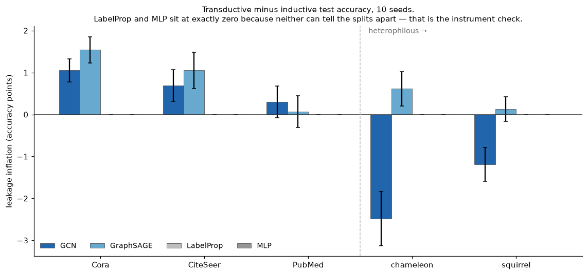
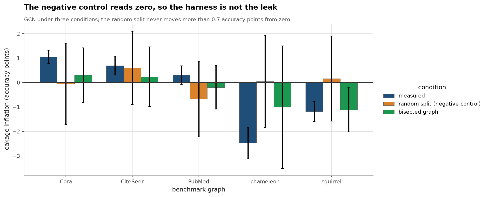
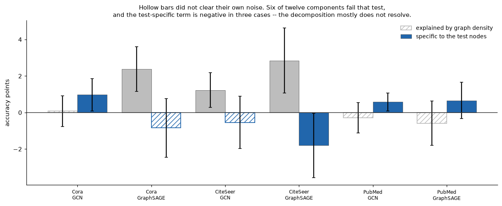
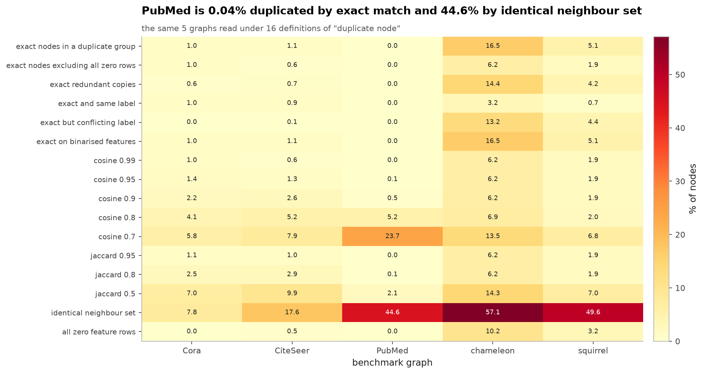
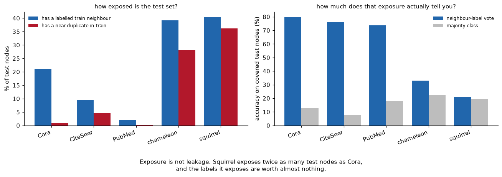

# LeakGraph: methods, controls and full results

The long-form version of the [README](../README.md). Every section below is the original
text, moved here unchanged so the README can stay short. The tables here are still written
by `make tables` from the committed artifacts in `reports/`.

---

## Abstract

Transductive node classification evaluates a model on nodes that were present in
the graph it trained on. The standard concern is that this leaks. This work
measures the size of that leak on five benchmarks and four models under one
protocol: identical splits, seeds, initialisation and epoch budget, differing
only in whether the test nodes existed in the training graph. The difference is
taken per seed and then averaged, so shared initialisation noise cancels.

Inflation is real on the homophilous citation graphs and small, at most 1.5
accuracy points, on Cora with GraphSAGE. On the two heterophilous graphs it
reverses: GCN *loses* 2.5 points to the transductive split. LabelProp and MLP
read exactly zero everywhere, which is the instrument check rather than a result,
since neither can distinguish the two splits. Exposure and leakage turn out to be
different quantities: squirrel exposes 40% of its test nodes to a labelled
training neighbour against Cora's 21% and still inflates less, because a vote
over those labels scores 21% there against a 19% majority baseline, versus 80%
against 13% on Cora. An attempt to decompose inflation into a density term and a
test-specific term mostly fails to resolve, and is reported as failing.

**Contributions.** (i) One harness measuring duplicate, feature-label and
neighbourhood-label leakage on the same splits with the same seeds. (ii) A
headline metric, leakage inflation, comparable across datasets and models. (iii)
Negative and density-matched controls, including a random split that reads zero.
(iv) Evidence that the duplicate rate is largely a choice of definition, ranging
from 0.04% to 45% on PubMed depending which is used.

## 1. Scope: this is tooling, not a discovery

Every phenomenon measured here is already documented in the literature. I did not find any of
it. What this repository contributes is a single harness that measures all of it on the same
splits with the same seeds under the same protocol, a headline metric that makes the cost
comparable across datasets and models, and a test suite that checks the instrument rather than
the result. Treat it as a measuring device and a replication, not as a novel claim.

See [Prior work](../README.md#11-prior-work) for what was already known, with sources I verified before
citing them.

`leakage inflation = transductive test accuracy − inductive test accuracy`, for the same
model, the same split, the same seed, the same initialisation and the same epoch budget. The
only thing that differs between the two arms is whether the test nodes existed in the graph
the model trained on.

The difference is computed **per seed and then averaged**, not as a difference of two averages.
Initialisation noise is shared between the arms and cancels in the paired difference, which is
what makes an effect of one accuracy point resolvable at all with ten seeds.

> **Read the `resolved?` column as split-specific.** Every cell marked *yes* here
> is on the shipped geom-gcn / Planetoid splits. Under ten random splits
> ([below](#a-second-split-scheme)) **not one of the ten GNN cells resolves**, and the
> two negative GCN readings become null. The controls read 0.0 ± 0.0 under both
> schemes, which is what makes the comparison trustworthy in either direction.

`resolved?` asks whether the mean paired difference exceeds two standard errors of that same
paired difference. Where it says **no**, I am not claiming an effect. A row reading `0.4 ± 1.1`
with `no` means I measured nothing that ten seeds can distinguish from zero, and it is reported
at the same size and in the same table as the rows that did resolve.

### What I actually found, including the parts that argue against the premise

I built this expecting transductive evaluation to be buying the GNNs a visible amount of
accuracy. Mostly it is not.

- **The effect is small everywhere.** Across ten (dataset, model) GNN cells, no resolved
  inflation exceeds 2.5 accuracy points in magnitude, and only five cells resolve at all. On **PubMed
  neither GNN shows anything**, 0.30 ± 1.20 and 0.07 ± 1.19 points, both unresolved. That is a
  negative result and I am stating it as plainly as the positive ones.
- **On chameleon and squirrel the GCN's inflation is negative and resolved** (−2.48 ± 2.05 and
  −1.19 ± 1.28 points) **on the geom-gcn splits**. Training on the graph *including* test nodes
  makes it measurably **worse** there. I would not read that as "transductive evaluation is safe
  on heterophilous data": the GCN is badly mis-specified on both (37.6% and 26.2%, against an MLP
  that scores 50.5% and 36.2% without using the graph at all), so extra neighbours mostly buy it
  more of a smoothing operation that was already hurting. The sign is real; the mechanism is a
  guess, and the sign itself does not survive a change of split (next bullet).
- **Every resolved cell in the headline table is specific to its split.** Re-run under ten
  random splits ([below](#a-second-split-scheme)), none of the five resolved GNN cells resolves
  again, and the two negative GCN readings are gone: chameleon +0.04 ± 1.89 and squirrel
  +0.16 ± 1.74 instead of −2.48 and −1.19; Cora GCN −0.06 ± 1.66 instead of +1.05. The
  random-split variance is roughly double, because it includes split variance the public-split
  numbers do not have. This is a negative result about the *metric's* stability, not evidence
  that the public-split numbers are wrong, and on chameleon and squirrel it is confounded with
  the random scheme's much smaller label budget. But no reading of it supports quoting a
  single-split inflation as a property of the dataset.
- **The duplicate component is nearly nothing.** Excluding test nodes that have a near-duplicate
  twin in training moves inflation by at most 0.8 points anywhere, including on squirrel, which
  has 1,580 straddling near-duplicate pairs. Duplicates are abundant; their contribution to
  *this particular* gap is small.
- **Most of what inflation there is turns out not to be leakage at all.** The
  [density control](#4-is-the-gap-actually-leakage) removes an equal number of *unlabelled*
  nodes instead of the test nodes. For GraphSAGE on Cora and CiteSeer that alone costs more
  accuracy than the full inflation does (2.4 and 2.8 points, both resolved), leaving a negative
  test-node-specific remainder. Only three of the twelve cells hold a *resolved positive*
  test-specific component, Cora GCN at 1.0, PubMed GCN at 0.6, PubMed GraphSAGE at 0.7, and
  CiteSeer GraphSAGE holds a resolved *negative* one at −1.8. The headline metric is, for the
  most part, measuring graph size.
- **The density control now runs on chameleon and squirrel too, and finds nothing resolvable.**
  Reserving half the test set as the removal pool makes the decomposition constructible where
  the geom-gcn splits leave no unlabelled nodes. On both datasets the total, the density cost
  and the test-specific remainder are all unresolved at ten seeds (chameleon GCN
  −1.0 ± 2.5 = −0.5 ± 2.9 + −0.5 ± 4.5; squirrel GCN −1.1 ± 0.9 = −0.5 ± 1.6 + −0.7 ± 2.2). The
  honest upgrade is from *not measurable* to *measured and null*, which is a smaller claim than
  it sounds like but a real one.
- **All four control tables read exactly `0.00` in all 36 of their MLP and LabelProp cells**
  total, density cost and test-specific alike. That is the only reason I trust the small numbers
  above, and it is the thing that was broken (see
  [Finding I1](#finding-i1-the-mlp-control-was-reporting-leakage-that-was-actually-a-dropout-rng-offset)).

The honest summary is that `transductive − inductive` is a much weaker instrument than I assumed
when I started building it. The density control showed that first; the second split scheme
showed it again and harder, since under it not one GNN cell resolves anywhere. I have left the
headline metric in place because it is what the literature's framing implies, and put both
controls immediately after it.

A caution on the third point: Platonov et al. showed that *removing* duplicate nodes changes GNN
performance and model rankings on squirrel and chameleon. That is a different measurement from
mine. They compare a dataset against a de-duplicated version of itself; I compare transductive
against inductive evaluation with the duplicates present in both arms. My small duplicate
component does not contradict their finding, and nothing here should be read as doing so.

**MLP and LabelProp are not results. They are the instrument's calibration.** Neither model can
have a transductive/inductive gap: the MLP never reads the graph, and label propagation has no
parameters and propagates the same training labels over the same full graph in both arms. Both
must read exactly `0.0`. They do. When they did not, the harness was broken, see
[Finding I1](#finding-i1-the-mlp-control-was-reporting-leakage-that-was-actually-a-dropout-rng-offset).

## 2. The headline number

Inflation is real on the homophilous citation graphs and small: 1.5 accuracy points at
most, on Cora with GraphSAGE. On the heterophilous pair it goes the other way, and GCN
loses 2.5 points to the transductive split rather than gaining. LabelProp and MLP sit at
exactly zero everywhere, which is the instrument check, neither can distinguish the two
splits, so any nonzero reading for them would mean the harness itself was leaking.

`leakage inflation = transductive test accuracy − inductive test accuracy`, for the same
model, the same split, the same seed, the same initialisation and the same epoch budget. The
only thing that differs between the two arms is whether the test nodes existed in the graph
the model trained on.

The difference is computed **per seed and then averaged**, not as a difference of two averages.
Initialisation noise is shared between the arms and cancels in the paired difference, which is
what makes an effect of one accuracy point resolvable at all with ten seeds.

<!--BEGIN:inflation-->

| dataset | model | transductive | inductive | **inflation** | resolved? |
|---|---|---|---|---|---|
| Cora | GCN | 81.3 ± 0.7 | 80.3 ± 0.7 | **1.0 ± 0.9** | yes |
| Cora | GraphSAGE | 80.4 ± 0.7 | 78.9 ± 0.8 | **1.5 ± 1.0** | yes |
| Cora | MLP | 56.9 ± 0.8 | 56.9 ± 0.8 | **0.0 ± 0.0** | **no** |
| Cora | LabelProp | 60.3 ± 0.0 | 60.3 ± 0.0 | **0.0 ± 0.0** | **no** |
| CiteSeer | GCN | 69.2 ± 0.7 | 68.5 ± 0.8 | **0.7 ± 1.2** | **no** |
| CiteSeer | GraphSAGE | 68.5 ± 1.3 | 67.5 ± 1.1 | **1.1 ± 1.4** | yes |
| CiteSeer | MLP | 52.7 ± 1.0 | 52.7 ± 1.0 | **0.0 ± 0.0** | **no** |
| CiteSeer | LabelProp | 36.6 ± 0.0 | 36.6 ± 0.0 | **0.0 ± 0.0** | **no** |
| PubMed | GCN | 78.6 ± 0.7 | 78.3 ± 0.6 | **0.3 ± 1.2** | **no** |
| PubMed | GraphSAGE | 76.8 ± 0.9 | 76.7 ± 0.9 | **0.1 ± 1.2** | **no** |
| PubMed | MLP | 72.5 ± 0.4 | 72.5 ± 0.4 | **0.0 ± 0.0** | **no** |
| PubMed | LabelProp | 42.0 ± 0.0 | 42.0 ± 0.0 | **0.0 ± 0.0** | **no** |
| chameleon | GCN | 37.6 ± 2.8 | 40.0 ± 2.6 | **-2.5 ± 2.0** | yes |
| chameleon | GraphSAGE | 51.6 ± 1.6 | 51.0 ± 1.7 | **0.6 ± 1.3** | **no** |
| chameleon | MLP | 50.5 ± 3.0 | 50.5 ± 3.0 | **0.0 ± 0.0** | **no** |
| chameleon | LabelProp | 21.8 ± 1.5 | 21.8 ± 1.5 | **0.0 ± 0.0** | **no** |
| squirrel | GCN | 26.2 ± 1.4 | 27.4 ± 1.8 | **-1.2 ± 1.3** | yes |
| squirrel | GraphSAGE | 37.4 ± 2.1 | 37.3 ± 1.9 | **0.1 ± 0.9** | **no** |
| squirrel | MLP | 36.2 ± 1.7 | 36.2 ± 1.7 | **0.0 ± 0.0** | **no** |
| squirrel | LabelProp | 17.8 ± 1.3 | 17.8 ± 1.3 | **0.0 ± 0.0** | **no** |

<!--END:inflation-->

> **Read the `resolved?` column as split-specific.** Every cell marked *yes* here
> is on the shipped geom-gcn / Planetoid splits. Under ten random splits
> ([below](#a-second-split-scheme)) **not one of the ten GNN cells resolves**, and the
> two negative GCN readings become null. The controls read 0.0 ± 0.0 under both
> schemes, which is what makes the comparison trustworthy in either direction.

`resolved?` asks whether the mean paired difference exceeds two standard errors of that same
paired difference. Where it says **no**, I am not claiming an effect. A row reading `0.4 ± 1.1`
with `no` means I measured nothing that ten seeds can distinguish from zero, and it is reported
at the same size and in the same table as the rows that did resolve.

## 3. What the number means

An accuracy gap on its own is uninterpretable. Two baselines bound it.

<!--BEGIN:baselines-->

| dataset | MLP (features, no graph) | neighbour vote (graph, no features, no learning) | GCN inductive | GCN inductive, same nodes as the vote |
|---|---|---|---|---|
| Cora | 56.9 | 79.6 (covers 21.1% of test) | 80.3 | 86.1 ± 1.0 |
| CiteSeer | 52.7 | 76.0 (covers 9.6% of test) | 68.5 | 73.5 ± 1.2 |
| PubMed | 72.5 | 73.7 (covers 1.9% of test) | 78.3 | 78.9 ± 0.0 |
| chameleon | 50.5 | 33.0 (covers 39.3% of test) | 40.0 | 36.2 ± 5.0 |
| squirrel | 36.2 | 20.7 (covers 40.3% of test) | 27.4 | 27.8 ± 2.3 |

<!--END:baselines-->

The neighbour vote has no features, no parameters and no training: it labels a test node by
majority vote over its training-set neighbours. It can only predict test nodes that *have* a
training neighbour, so the last column scores the GCN on exactly that subset, which is the only
way the two numbers answer the same question.

## 4. Is the gap actually leakage?

The random split is the negative control: it has no temporal or structural reason
to leak, so a non-zero reading there would be a fault in the harness rather than a
finding. It reads zero. The bisected-graph condition cuts the edges between the
two halves and the inflation goes with them.

Transductive minus inductive is confounded. The inductive training graph is missing the test
nodes' information, which is the effect I want to price, but it is also simply a smaller and
sparser graph, and that costs accuracy on its own for reasons that have nothing to do with
leakage.

So I ran a third arm. `density_control` removes the same *number* of nodes from the inductive
view, but draws them from the unlabelled pool, nodes the model was never going to be scored on, instead of the test set. That splits the headline gap in two:

    transductive − density_control  = the cost of a smaller, sparser training graph
    density_control − inductive     = what is specific to hiding the test nodes

<!--BEGIN:density-->

| dataset | model | total inflation | density cost | resolved? | test-node-specific | resolved? |
|---|---|---|---|---|---|---|
| Cora | GCN | 1.0 ± 0.9 | 0.1 ± 0.8 | **no** | 1.0 ± 0.9 | yes |
| Cora | GraphSAGE | 1.5 ± 1.0 | 2.4 ± 1.2 | yes | -0.8 ± 1.6 | **no** |
| Cora | MLP | 0.0 ± 0.0 | 0.0 ± 0.0 | **no** | 0.0 ± 0.0 | **no** |
| Cora | LabelProp | 0.0 ± 0.0 | 0.0 ± 0.0 | **no** | 0.0 ± 0.0 | **no** |
| CiteSeer | GCN | 0.7 ± 1.2 | 1.2 ± 1.0 | yes | -0.5 ± 1.4 | **no** |
| CiteSeer | GraphSAGE | 1.1 ± 1.4 | 2.8 ± 1.8 | yes | -1.8 ± 1.8 | yes |
| CiteSeer | MLP | 0.0 ± 0.0 | 0.0 ± 0.0 | **no** | 0.0 ± 0.0 | **no** |
| CiteSeer | LabelProp | 0.0 ± 0.0 | 0.0 ± 0.0 | **no** | 0.0 ± 0.0 | **no** |
| PubMed | GCN | 0.3 ± 1.2 | -0.3 ± 0.8 | **no** | 0.6 ± 0.5 | yes |
| PubMed | GraphSAGE | 0.1 ± 1.2 | -0.6 ± 1.2 | **no** | 0.7 ± 1.0 | yes |
| PubMed | MLP | 0.0 ± 0.0 | 0.0 ± 0.0 | **no** | 0.0 ± 0.0 | **no** |
| PubMed | LabelProp | 0.0 ± 0.0 | 0.0 ± 0.0 | **no** | 0.0 ± 0.0 | **no** |

<!--END:density-->

**This is the most consequential table in the repository, and it undercuts the headline metric.**
For GraphSAGE on Cora and CiteSeer the density cost (2.4 and 2.8 points) is *larger than the
total inflation*, and the test-node-specific remainder is negative. In other words, essentially
none of GraphSAGE's apparent leakage inflation on the citation networks is leakage: it is the
model reacting to a training graph with 1,000 fewer nodes in it. The same is true of CiteSeer
GCN. Only **Cora GCN** has its inflation survive the control roughly intact (1.0 total, 0.1
density, 1.0 test-specific), and that is the one cell whose test-specific component resolves
while its density cost does not.

Two smaller notes. On PubMed the density cost is slightly *negative*, the smaller graph trained
marginally better, so the test-specific component (0.6 and 0.7 points) is larger than the
unresolved total, which is a reminder that the two components need not have the same sign. And
each component now carries its own two-standard-error resolution mark, which an earlier version
of this table did not have. It changes the reading: **seven of the twelve components resolve**,
and they are not the ones a glance at the point estimates would pick. Cora GCN's test-specific
1.0 resolves while its density cost does not; PubMed's two test-specific components (0.6 and
0.7) resolve even though neither total does; CiteSeer GraphSAGE resolves *both*, a density cost
of 2.8 and a test-specific component of −1.8.

The MLP and LabelProp rows are the same calibration as in the headline table, extended to the
third arm: neither model can react to which nodes were removed, so all three of their columns
must read exactly `0.00`, and they do.

The control needs spare unlabelled nodes to remove. The Planetoid public splits leave most of
the graph unlabelled, so it works there. The geom-gcn splits of chameleon and squirrel assign
every single node to train, val or test, so no pool exists and the control cannot be built
*this way*, which is why those two datasets are absent from this table, and why the next two
sections build it a different way.

### Recovering the control where the split leaves no pool

A pool of unlabelled nodes can be manufactured out of the test set itself. Reserve half of it:
those nodes keep their features and their edges in the graph, their labels are never used for
anything, and they are never scored. That is exactly the status of an unlabelled Planetoid
node, so the control becomes constructible on every dataset. The price is a test set half the
size, noisier, and an inductive arm that removes half as many nodes, so the density cost is
expected to be smaller in absolute terms than in the table above.

The bisection is not assumed to be valid. It is run on the Planetoid datasets too, where the
ordinary control also works, so the two constructions can be compared on the same graphs
before the bisected one is trusted on the two where nothing else works.

<!--BEGIN:bisected-->

| dataset | model | total inflation | density cost | resolved? | test-node-specific | resolved? |
|---|---|---|---|---|---|---|
| Cora | GCN | 0.3 ± 1.1 | 0.3 ± 1.2 | **no** | 0.0 ± 0.5 | **no** |
| Cora | GraphSAGE | 1.3 ± 1.3 | 1.1 ± 1.4 | yes | 0.2 ± 1.6 | **no** |
| Cora | MLP | 0.0 ± 0.0 | 0.0 ± 0.0 | **no** | 0.0 ± 0.0 | **no** |
| Cora | LabelProp | 0.0 ± 0.0 | 0.0 ± 0.0 | **no** | 0.0 ± 0.0 | **no** |
| CiteSeer | GCN | 0.2 ± 1.2 | 0.4 ± 1.3 | **no** | -0.2 ± 1.4 | **no** |
| CiteSeer | GraphSAGE | 0.5 ± 1.4 | 0.7 ± 1.1 | **no** | -0.2 ± 1.4 | **no** |
| CiteSeer | MLP | 0.0 ± 0.0 | 0.0 ± 0.0 | **no** | 0.0 ± 0.0 | **no** |
| CiteSeer | LabelProp | 0.0 ± 0.0 | 0.0 ± 0.0 | **no** | 0.0 ± 0.0 | **no** |
| PubMed | GCN | -0.2 ± 0.9 | -0.1 ± 0.9 | **no** | -0.1 ± 0.8 | **no** |
| PubMed | GraphSAGE | -0.1 ± 1.0 | -0.3 ± 1.3 | **no** | 0.2 ± 0.8 | **no** |
| PubMed | MLP | 0.0 ± 0.0 | 0.0 ± 0.0 | **no** | 0.0 ± 0.0 | **no** |
| PubMed | LabelProp | 0.0 ± 0.0 | 0.0 ± 0.0 | **no** | 0.0 ± 0.0 | **no** |
| chameleon | GCN | -1.0 ± 2.5 | -0.5 ± 2.9 | **no** | -0.5 ± 4.5 | **no** |
| chameleon | GraphSAGE | 0.0 ± 2.7 | -0.5 ± 3.0 | **no** | 0.5 ± 2.3 | **no** |
| chameleon | MLP | 0.0 ± 0.0 | 0.0 ± 0.0 | **no** | 0.0 ± 0.0 | **no** |
| chameleon | LabelProp | 0.0 ± 0.0 | 0.0 ± 0.0 | **no** | 0.0 ± 0.0 | **no** |
| squirrel | GCN | -1.1 ± 0.9 | -0.5 ± 1.6 | **no** | -0.7 ± 2.2 | **no** |
| squirrel | GraphSAGE | -0.5 ± 1.5 | 0.2 ± 1.8 | **no** | -0.7 ± 1.4 | **no** |
| squirrel | MLP | 0.0 ± 0.0 | 0.0 ± 0.0 | **no** | 0.0 ± 0.0 | **no** |
| squirrel | LabelProp | 0.0 ± 0.0 | 0.0 ± 0.0 | **no** | 0.0 ± 0.0 | **no** |

<!--END:bisected-->

One detail worth stating: after bisection the pool is *exactly* the size the control needs, so
the control removes precisely the reserved half rather than sampling from a larger pool. There
is no draw variance, and the removed nodes come from the same population as the scored ones
a tighter match than the ordinary control manages, where they are drawn from the unlabelled
pool instead.

**What it says, and where it disagrees with the ordinary control.** On chameleon and squirrel
the decomposition is now constructible and nothing in it resolves: chameleon GCN −1.0 ± 2.5
total, −0.5 ± 2.9 density, −0.5 ± 4.5 test-specific; squirrel GCN −1.1 ± 0.9, −0.5 ± 1.6,
−0.7 ± 2.2. Every component on both datasets sits inside two standard errors of zero. The
question the original limitation posed, is chameleon's negative inflation a density effect or
a test-node effect?, now has an answer, and the answer is that ten seeds on a halved test set
cannot tell.

On the Planetoid datasets, where both constructions run, they agree in magnitude but not
everywhere in attribution. The bisected density costs are roughly half the ordinary ones (Cora
GraphSAGE 1.1 against 2.4, CiteSeer GraphSAGE 0.7 against 2.8), which is what halving the number
of removed nodes should do. But Cora GCN's resolved positive test-specific component (1.0 ± 0.9
in the ordinary control) reads 0.0 ± 0.5 under bisection, and no bisected cell on CiteSeer or
PubMed resolves at all. The bisection is the weaker instrument, half the scored nodes and half
the perturbation, so where the two disagree I trust the ordinary control on the datasets that
support it, and read the bisected chameleon and squirrel rows as *nothing resolved* rather than
as measurements of zero.

### A second split scheme

The other route is to stop using the shipped splits. Ten random Planetoid-style splits per
dataset (20 nodes per class for training, 500 validation, 500 test) leave a large unlabelled
pool everywhere, including on chameleon and squirrel, and share no construction with the
bisection above. This also answers a separate limitation: variance here includes split
variance, not initialisation variance alone.

<!--BEGIN:randomsplit-->

| dataset | model | total inflation | density cost | resolved? | test-node-specific | resolved? |
|---|---|---|---|---|---|---|
| Cora | GCN | -0.1 ± 1.7 | 0.4 ± 1.7 | **no** | -0.5 ± 1.9 | **no** |
| Cora | GraphSAGE | 0.1 ± 1.7 | 1.0 ± 2.2 | **no** | -0.9 ± 2.6 | **no** |
| Cora | MLP | 0.0 ± 0.0 | 0.0 ± 0.0 | **no** | 0.0 ± 0.0 | **no** |
| Cora | LabelProp | 0.0 ± 0.0 | 0.0 ± 0.0 | **no** | 0.0 ± 0.0 | **no** |
| CiteSeer | GCN | 0.6 ± 1.5 | -0.2 ± 1.9 | **no** | 0.8 ± 1.2 | yes |
| CiteSeer | GraphSAGE | 0.4 ± 2.2 | 0.3 ± 1.2 | **no** | 0.1 ± 2.1 | **no** |
| CiteSeer | MLP | 0.0 ± 0.0 | 0.0 ± 0.0 | **no** | 0.0 ± 0.0 | **no** |
| CiteSeer | LabelProp | 0.0 ± 0.0 | 0.0 ± 0.0 | **no** | 0.0 ± 0.0 | **no** |
| PubMed | GCN | -0.7 ± 1.5 | -0.1 ± 1.1 | **no** | -0.6 ± 1.0 | **no** |
| PubMed | GraphSAGE | -0.2 ± 1.5 | 0.1 ± 1.1 | **no** | -0.4 ± 1.3 | **no** |
| PubMed | MLP | 0.0 ± 0.0 | 0.0 ± 0.0 | **no** | 0.0 ± 0.0 | **no** |
| PubMed | LabelProp | 0.0 ± 0.0 | 0.0 ± 0.0 | **no** | 0.0 ± 0.0 | **no** |
| chameleon | GCN | 0.0 ± 1.9 | -0.1 ± 1.9 | **no** | 0.1 ± 1.8 | **no** |
| chameleon | GraphSAGE | 0.8 ± 1.3 | -0.5 ± 1.3 | **no** | 1.3 ± 2.0 | yes |
| chameleon | MLP | 0.0 ± 0.0 | 0.0 ± 0.0 | **no** | 0.0 ± 0.0 | **no** |
| chameleon | LabelProp | 0.0 ± 0.0 | 0.0 ± 0.0 | **no** | 0.0 ± 0.0 | **no** |
| squirrel | GCN | 0.2 ± 1.7 | -0.2 ± 1.4 | **no** | 0.4 ± 1.2 | **no** |
| squirrel | GraphSAGE | -0.1 ± 1.4 | 0.1 ± 1.4 | **no** | -0.2 ± 1.9 | **no** |
| squirrel | MLP | 0.0 ± 0.0 | 0.0 ± 0.0 | **no** | 0.0 ± 0.0 | **no** |
| squirrel | LabelProp | 0.0 ± 0.0 | 0.0 ± 0.0 | **no** | 0.0 ± 0.0 | **no** |

<!--END:randomsplit-->

**This is the harshest table in the repository.** Under a second split scheme, *not one* of the
ten GNN total-inflation cells resolves. The five cells that resolved on the shipped splits do
not resolve here, and the two that were negative and resolved, chameleon and squirrel GCN, at
−2.5 and −1.2, read +0.0 ± 1.9 and +0.2 ± 1.7. Two decomposed components do resolve, both
test-specific and both positive: CiteSeer GCN at +0.8 ± 1.2 and chameleon GraphSAGE at
+1.3 ± 2.0, two hits out of the thirty components in the table, which is about what ten seeds
and a two-standard-error bar will hand you by chance. I am not building anything on them.

The variances are roughly double those of the headline table, which is the mechanism: this
scheme's error bars include split variance, and the public-split ones do not. That alone is
worth the run, it says the headline table's error bars understate the uncertainty of any claim
about a *dataset*, as opposed to a claim about one particular split of it.

Two cautions on reading this as a refutation. The random scheme gives every dataset 20 labels
per class, which for chameleon and squirrel is far less supervision than the geom-gcn splits'
48%, so those two rows change the model as well as the split. And a wider error bar is not the
same as a smaller effect: the point estimates on Cora move to roughly zero, but on chameleon
they mostly move because the model is different.

`resolved?` is the same two-standard-error test as the headline table, applied to each
component separately. It is a stricter reading than the original density table offered, and it
is applied to that table too, which is how Cora GCN's test-specific component, PubMed's two,
and CiteSeer GraphSAGE's negative one turn out to be the only resolved ones there.

## 5. Decomposing by duplicates

Adding test nodes does two things at once: it makes the graph denser, helping any
node, and it exposes the test nodes' own neighbourhoods. The density control
separates them by adding an equal number of non-test nodes instead. Reported here
because it mostly **does not resolve**: six of twelve components fail to clear
their own noise, drawn hollow above, and the test-specific term comes out negative
in three cases. The split is not a clean attribution and is not presented as one.

A duplicate pair only leaks if it *straddles* the train/test boundary. Two identical nodes both
sitting in the training set teach a model nothing it could not have learned from either copy;
it is the pair with one foot in train and one in test that hands over the answer.

So the same paired difference is recomputed while scoring only test nodes that have **no**
near-duplicate twin anywhere in the training set. Whatever inflation disappears is what the
straddling duplicates were worth.

<!--BEGIN:components-->

| dataset | model | inflation (all test) | inflation (no straddling duplicates) | duplicate component |
|---|---|---|---|---|
| Cora | GCN | 1.0 ± 0.9 | 1.1 ± 0.9 | -0.0 |
| Cora | GraphSAGE | 1.5 ± 1.0 | 1.6 ± 1.0 | -0.0 |
| CiteSeer | GCN | 0.7 ± 1.2 | 0.6 ± 1.3 | 0.1 |
| CiteSeer | GraphSAGE | 1.1 ± 1.4 | 1.0 ± 1.3 | 0.1 |
| PubMed | GCN | 0.3 ± 1.2 | 0.3 ± 1.2 | 0.0 |
| PubMed | GraphSAGE | 0.1 ± 1.2 | 0.1 ± 1.2 | -0.0 |
| chameleon | GCN | -2.5 ± 2.0 | -3.2 ± 2.7 | 0.8 |
| chameleon | GraphSAGE | 0.6 ± 1.3 | -0.2 ± 1.9 | 0.8 |
| squirrel | GCN | -1.2 ± 1.3 | -1.6 ± 2.3 | 0.4 |
| squirrel | GraphSAGE | 0.1 ± 0.9 | 0.9 ± 1.0 | -0.8 |

<!--END:components-->

## 6. The detectors

"Duplicate node" has no single meaning, and the choice dominates the answer.
PubMed is 0.04% duplicated under exact match and 44.6% duplicated under identical
neighbour set. Any headline duplicate figure is a threshold decision before it is
a measurement, which is why all sixteen are reported rather than one.

Exposure and leakage are not the same quantity, which is the most useful thing these
detectors show. Squirrel exposes 40% of its test nodes to a labelled training neighbour
against Cora's 21%, and still inflates less, because a vote over those neighbours' labels
scores 21% there against a 19% majority baseline, almost nothing, while on Cora the same
vote scores 80% against 13%. The channel is wide open on the heterophilous graphs and
carries no signal.

### Duplicate and near-duplicate nodes

<!--BEGIN:duplicates-->

| dataset | nodes | exact duplicate nodes | all-zero feature rows | near-dup pairs | cutoff | straddling pairs | test nodes with a train twin |
|---|---|---|---|---|---|---|---|
| Cora | 2708 | 27 (1.0%) | 0 | 440 | 0.474 | 10 | 8 / 1000 (0.8%) |
| CiteSeer | 3327 | 35 (1.1%) | 15 | 2790 | 0.292 | 51 | 45 / 1000 (4.5%) |
| PubMed | 19717 | 7 (0.0%) | 0 | 188 | 0.904 | 1 | 1 / 1000 (0.1%) |
| chameleon | 2277 | 375 (16.5%) | 233 | 3395 | 0.378 | 683 | 128 / 456 (28.1%) |
| squirrel | 5201 | 265 (5.1%) | 165 | 7348 | 0.354 | 1580 | 377 / 1041 (36.2%) |

<!--END:duplicates-->

Two of these line up with the literature and one does not. My **1.0% exact duplicate nodes on
Cora** matches the "1% of the nodes are duplicated" figure that OGB quotes from Zou et al. My
**16.5% on chameleon and 5.1% on squirrel** are consistent with Platonov et al.'s "large number
of duplicate nodes" in exactly those two datasets. But I measure **1.1% on CiteSeer against the
5% quoted**. The next section is an attempt to reconcile that, and it fails.

Note also how weakly duplicate abundance predicts leakage here. squirrel has 1,580 straddling
pairs and 36.2% of its test nodes have a training twin, the worst in the table, and its GCN
inflation is *negative*.

The cosine cutoff is **calibrated, not chosen**. I build a null by permuting each feature column
independently, which preserves every feature's marginal frequency exactly while destroying all
co-occurrence structure between nodes, then take the largest cosine similarity any pair achieves
under that null. A real pair at or above that line is more similar than every pair drawn from
independent nodes with identical marginals.

What that justifies is a threshold, not a per-pair p-value. The real graph has far more pairs
than the null subsample did, so it gets more chances to clear the bar by luck, and the counts
should be read as an upper bound. Counts at fixed cutoffs of 0.95 and 0.99 are in
`reports/detectors.json` so the sensitivity to that choice is visible.

The `all-zero feature rows` column exists because of a real inconsistency. A node whose feature
vector is entirely zero is an exact duplicate of every other such node, so `torch.unique` counts
it, but cosine similarity is undefined for a zero vector, so it can never appear among the
near-duplicate pairs and is invisible to the straddling analysis. Rather than let the two
duplicate measurements disagree for an unstated reason, both are reported.

### Trying to reconcile the CiteSeer duplicate rate

"Duplicate" is not one definition, so the disagreement might be a definitional difference
rather than a conflict. `make duplicate-definitions` evaluates eighteen readings of it on all
five datasets: exact feature match counted four different ways, with and without labels, with
and without the all-zero rows, near-duplicates at five cosine cutoffs and three Jaccard
cutoffs, and duplication defined on the graph instead of the features.

The constraint that makes this a real test rather than a fishing expedition is that both
quoted figures come from the same sentence of the same source. A candidate definition has to
produce ≈1% on Cora **and** ≈5% on CiteSeer *at the same setting*. Equivalently, it has to
make CiteSeer roughly **five times** Cora, and that ratio does not depend on either absolute
level.

<!--BEGIN:dupdefs-->

| definition | Cora | CiteSeer | CiteSeer / Cora | PubMed | chameleon | squirrel |
|---|---|---|---|---|---|---|
| _quoted by OGB from Zou et al._ | _1.0_ | _5.0_ | _5.0_ | _-_ | _-_ | _-_ |
| `exact_but_conflicting_label` | 0.00 | 0.12 | ∞ | 0.02 | 13.22 | 4.42 |
| `all_zero_feature_rows` | 0.00 | 0.45 | ∞ | 0.00 | 10.23 | 3.17 |
| `exact_duplicate_pairs_over_nodes_excluding_zero_rows` | 0.81 | 0.30 | 0.37 | 0.03 | 10.36 | 1.50 |
| `exact_nodes_excluding_all_zero_rows` | 1.00 | 0.60 | 0.60 | 0.04 | 6.24 | 1.92 |
| `cosine_0.99` | 1.00 | 0.60 | 0.60 | 0.04 | 6.24 | 1.92 |
| `jaccard_0.95` | 1.14 | 0.96 | 0.84 | 0.04 | 6.24 | 1.92 |
| `cosine_0.95` | 1.37 | 1.26 | 0.92 | 0.10 | 6.24 | 1.92 |
| `exact_and_same_label` | 1.00 | 0.93 | 0.93 | 0.02 | 3.25 | 0.67 |
| `exact_nodes_in_a_duplicate_group` | 1.00 | 1.05 | 1.06 | 0.04 | 16.47 | 5.10 |
| `exact_on_binarised_features` | 1.00 | 1.05 | 1.06 | 0.04 | 16.47 | 5.10 |
| `jaccard_0.8` | 2.47 | 2.89 | 1.17 | 0.12 | 6.24 | 1.92 |
| `cosine_0.9` | 2.18 | 2.58 | 1.19 | 0.47 | 6.24 | 1.92 |
| `exact_redundant_copies` | 0.59 | 0.72 | 1.22 | 0.02 | 14.36 | 4.25 |
| `cosine_0.8` | 4.10 | 5.17 | 1.26 | 5.24 | 6.94 | 2.04 |
| `cosine_0.7` | 5.80 | 7.94 | 1.37 | 23.73 | 13.48 | 6.81 |
| `jaccard_0.5` | 7.02 | 9.86 | 1.41 | 2.06 | 14.27 | 6.96 |
| `identical_neighbour_set` | 7.75 | 17.64 | 2.28 | 44.61 | 57.09 | 49.63 |
| `exact_duplicate_pairs_over_nodes` | 0.81 | 3.46 | 4.25 | 0.03 | 1197.36 | 261.64 |

| similarity | cutoff that puts CiteSeer at 5% | CiteSeer there | Cora there | Cora quoted |
|---|---|---|---|---|
| cosine | 0.8006 | 5.05 | 3.95 | 1.0 |
| jaccard | 0.6667 | 5.17 | 4.10 | 1.0 |

<!--END:dupdefs-->

The second table is the direct solve: bisect for the similarity cutoff at which CiteSeer reads
exactly 5%, then read Cora at that same cutoff.

**None of the eighteen reproduces both figures, and the reason is not the threshold.** Fourteen
of them put CiteSeer within a factor of 1.5 of Cora; the quote needs a factor of 5. The four
that clear 1.5 all fail for their own reason. Two (`exact_but_conflicting_label`,
`all_zero_feature_rows`) read exactly 0.00% on Cora, so their ratio is infinite while both
absolute numbers sit far below the quoted pair. `identical_neighbour_set` reaches 2.28 but at
7.75% and 17.64%, nowhere near 1% and 5%. And `exact_duplicate_pairs_over_nodes`, 0.81% Cora,
3.46% CiteSeer, ratio 4.25, easily the closest, is an artefact twice over: it normalises a
pair count by a node count, so it is not a percentage at all (chameleon reads 1197%), and
CiteSeer's 15 all-zero feature rows are mutually identical and contribute 105 of its 115
duplicate pairs on their own. Drop those rows and the ratio inverts to 0.37.

Nor is it a matter of choosing a looser similarity cutoff. Solving for the cosine threshold that
puts CiteSeer at exactly 5% gives 0.8006, and Cora reads **3.95%** there, not 1%. Jaccard gives
the same shape. Every cutoff that lifts CiteSeer to 5% lifts Cora with it.

So the disagreement is not definitional in any way I could construct. Zou et al. either
measured on a different artifact of CiteSeer than the one `torch_geometric` ships, the raw
corpus rather than the bag-of-words matrix is the obvious candidate, and CiteSeer's raw
corpus is known to contain duplicate documents, or measured something other than feature
rows entirely. I could not retrieve the section of the primary source that would say which.
My number for CiteSeer is **1.05%**, the same detector reproduces Cora's quoted 1.00%
exactly, and the disagreement stands unresolved rather than explained away.

### Feature, label leakage

How much of the label is already in a node's own features, with no graph at all.

<!--BEGIN:features-->

| dataset | logistic regression on features alone | majority class | giveaway features | expected under label-permuted null | test nodes covered |
|---|---|---|---|---|---|
| Cora | 57.6 | 13.0 | 3 / 1433 | 0.0 | 7.2% |
| CiteSeer | 59.3 | 7.7 | 0 / 3703 | 0.0 | 0.0% |
| PubMed | 72.9 | 18.0 | 9 / 500 | 0.4 | 50.1% |
| chameleon | 44.7 | 22.4 | 61 / 2325 | 1.0 | 9.6% |
| squirrel | 35.4 | 19.3 | 4 / 2089 | 0.2 | 1.3% |

<!--END:features-->

The striking column is `giveaway features`: **3 of Cora's 1,433 features and 0 of CiteSeer's
3,703**, against a label-permuted null of essentially zero. By this definition, a single feature
whose presence pins the label down with 95% purity and at least 5 training nodes' support
CiteSeer has no feature-label leakage at all. That sits oddly beside the "62% leakage rate"
quoted for CiteSeer, and is the clearest evidence that the quoted figure measures something
other than what I measure here. PubMed is the opposite case: 9 giveaway features covering half
the test set, on only 500 features.

`logistic regression on features alone` is the ceiling: whatever a GNN scores, the part below
this line was never graph learning. Note that on **PubMed the MLP reaches 72.5% against the
GCN's 78.3%**, so most of PubMed's headline accuracy is available without the graph at all. `giveaway features` is the mechanism, individual feature
dimensions (single vocabulary words, for the citation datasets) whose mere presence pins the
label down. Purity is measured on the training set only and then applied to test nodes, so it is
leakage that actually transfers rather than an in-sample artefact, and the count is compared
against a label-permuted null so that "how many would you expect by chance" is measured rather
than assumed.

### Neighbourhood label leakage

Covered by the neighbour-vote column in [What the number means](#3-what-the-number-means).
Full output, including coverage and the accuracy restricted to covered nodes, is in
`reports/detectors.json`.

## 7. The inductive split is the thing that has to be right

Everything above is worthless if the inductive split is not actually inductive, and it is easy
to get subtly wrong. The common shortcut is to keep the full node feature matrix and merely drop
the edges touching test nodes. That is *probably* fine for a plain GCN, since isolated rows do
not influence anyone else's representation, but it is not provable, it breaks the moment a
model uses any node-set-level statistic (BatchNorm over all nodes, a global readout, degree
normalisation over the full index), and it cannot be tested by construction.

So `induced_subgraph` physically removes the nodes and relabels the survivors to `0..k-1`. The
test nodes do not exist during training. They are re-attached, with all their edges, only at
inference, exactly as an unseen node would arrive in deployment.

That property is asserted as an experiment rather than a claim about shapes:

- `test_inductive_training_is_blind_to_test_features` overwrites every test node's features with
  noise at 100x scale and asserts the inductive training loss is **bit-identical**, while the
  transductive loss moves.
- `test_inductive_training_is_blind_to_test_edges` rewires every test-node edge endpoint to a
  different random test node and asserts the same.

Validation also happens inside the training view, so in the inductive arm the model is never
scored on a graph containing test nodes until inference and model selection cannot leak either.

`make test` runs the suite. It builds a synthetic planted-partition graph in process, touches no
network and downloads nothing, which is what lets CI run it. CI additionally asserts that the
test run left `data/` empty.

## 8. Instrument bugs

Both of these were found by the controls, not by inspection. They are recorded here rather than
quietly patched, because a harness that has never been caught being wrong is a harness nobody
has checked.

### Finding I1: the MLP control was reporting leakage that was actually a dropout RNG offset

The MLP cannot have a transductive/inductive gap. It never reads `edge_index`, and the inductive
view leaves every training node's features untouched, so the two arms are the same computation.
It was nevertheless reporting a non-zero one.

Cause: the MLP was being handed the full node feature matrix and its output sliced afterwards.
`F.dropout` therefore drew its mask at the *view's* shape, and the inductive view has fewer
rows than the transductive one. The two arms consumed the RNG stream differently, so the
training nodes received different dropout masks, and the resulting accuracy difference had
nothing to do with leakage.

Measured before the fix, over 10 seeds (`reports/instrument_bug_mlp_rng.json`):

| dataset | mean spurious gap | std | largest single seed |
|---|---|---|---|
| Cora | +0.89 pp | 1.51 | 3.9 pp |
| CiteSeer | +0.69 pp | 1.92 | 3.0 pp |

The mean is small, but it is the same order of magnitude as the real GCN inflation this
repository measures on Cora, and on individual seeds it was several times larger. Had the
control not been there, I would have reported a fabricated effect at roughly the size of the
genuine one.

Fix: `uses_graph = False` on graph-free models, and the harness runs them on the masked rows
only, so the dropout draw cannot depend on how many other nodes happen to be in the view. The
control now reads exactly `0.0`, and `test_mlp_has_exactly_zero_inflation` asserts it.

### Finding I2: `random_split` silently produced an empty test set

Asking the Planetoid defaults (500 val, 1000 test) of a graph too small to supply them made the
test slice come out empty. Every downstream accuracy then became `NaN`, reproducibly, and with
no error. A metric that is silently `NaN` is worse than a crash, because it looks like a result.
`random_split` now raises, and `test_random_split_refuses_to_silently_produce_an_empty_test_set`
pins it. Found by a test that was trying to check something else.

### Finding I3: two duplicate measurements disagreed for an unstated reason

All-zero feature rows are exact duplicates of one another and `torch.unique` counts them as
such, but cosine similarity is undefined for a zero vector, so they can never appear among the
near-duplicate pairs and were invisible to the straddling analysis. Rather than silently pick a
convention, `DuplicateReport` now carries `zero_feature_nodes`, so the gap between the two
counts is visible in the table rather than being an unexplained inconsistency.

### Finding I4: the neighbourhood-leakage comparison was invalid as first written

The neighbour vote can only predict test nodes that have at least one training-set neighbour.
On Cora's public split that is a minority of the test set. Comparing the vote's accuracy on
that subset against a GCN's accuracy on the *whole* test set is not a comparison, it is two
different questions with one label. The harness now also records GNN accuracy restricted to
exactly the covered subset, which is the last column of the baselines table.

The pre-fix numbers in `reports/instrument_bug_mlp_rng.json` cannot be reproduced by the code in
this repository, and that is deliberate: the current harness returns exactly `0.0`, which is the
whole point of the fix. The artifact is committed as the record of the measurement.

## 9. Limitations

- **Hyperparameters are fixed, not tuned.** One setting (2 layers, hidden 64, dropout 0.5, Adam
  at lr 0.01 and weight decay 5e-4, up to 300 epochs, best-validation checkpoint) is used for
  every dataset, model and regime. Absolute accuracies are therefore below published numbers,
  especially on chameleon and squirrel where these homophily-oriented defaults are a poor fit.
  Inflation is a paired difference under identical hyperparameters, which is what it is designed
  to measure, but I have not tested whether tuning each regime separately would change it. It
  might: a model trained on a smaller graph may want different regularisation.
- **The headline tables use the standard splits.** Planetoid results use the single public
  split, so their variance is over initialisation only and does not include split variance.
  chameleon and squirrel use the ten geom-gcn splits, one per seed, so their variance includes
  both and is correspondingly larger. The two protocols are not directly comparable to each
  other. A second, uniform random-split scheme is now measured alongside them
  ([above](#a-second-split-scheme)), and it is a *different* protocol rather than a robustness
  check of the same one: 20 labels per class is far more label-scarce than the geom-gcn splits'
  48%, so on chameleon and squirrel it trains a much weaker model. Where the two schemes
  disagree, label scarcity is confounded with the split.
- **Still one hyperparameter setting and one scale.** No tuning per regime, nothing at OGB
  scale.
- **The near-duplicate threshold is permissive.** It controls for "how similar do independent
  nodes get by chance" but not for the fact that the real graph has more pairs and therefore
  more chances to clear the bar. Counts are an upper bound.
- **Inference re-attaches test nodes to the full graph**, so test, test edges are visible at
  inference. That matches the usual "a batch of new nodes arrives together" deployment story,
  not the stricter "one node at a time" one, which would be a different and lower number.
- **Nothing here is causal.** Inflation is an accounting difference between two protocols. The
  density control separates the size effect from the test-node-specific effect, but neither
  component is a claim about mechanism inside the model.

## 10. What I could not measure

- ~~**The density control on chameleon and squirrel.**~~ Now measured, two ways, by reserving
  half the test set as the removal pool, and again under a second split scheme that leaves a
  pool of its own. See [above](#recovering-the-control-where-the-split-leaves-no-pool). What
  remains unmeasurable there is a *resolved* decomposition: the components are constructible
  but almost none of them clear two standard errors at ten seeds.
- **A reproduction of the 42%/62% feature-label figures.** Those papers report "42% of nodes
  leak information between features and labels" for Cora without, in what I read, defining the
  measurement. My feature-label detector reports related quantities (logistic-regression
  accuracy, giveaway feature counts) but they are not the same statistic, so the numbers here
  neither confirm nor contradict theirs. My giveaway count on CiteSeer is zero; theirs is 62%
  of nodes. Those two things can both be true of different definitions.
- **Why my CiteSeer duplicate rate (1.05%) disagrees with the quoted 5%.** Eighteen definitions
  were tried and none reproduces the quoted Cora/CiteSeer pair; the disagreement is not a
  threshold, a label convention, or a pairs-versus-nodes convention. See
  [above](#trying-to-reconcile-the-citeseer-duplicate-rate). What I still could not do is
  retrieve the section of the primary source that would say what they counted, so I cannot
  identify the definition that *would* work, only rule out eighteen that do not.
- **Exact duplicate counts from the primary source.** I verified that Zou et al. claim
  duplicates and feature-label leaks in Cora and CiteSeer, and I verified OGB's quotation of
  their percentages verbatim, but I could not retrieve the section of Zou et al. containing the
  per-dataset numbers themselves. The duplicate counts in this README are my own measurements.
- **Anything about node ordering or dataset provenance.** This kit takes the datasets as
`torch_geometric` ships them.
- **Whether inflation transfers to other architectures.** Two GNNs, one hidden size, one
  optimiser, one learning rate. No hyperparameter sweep, so I cannot claim the gap is invariant
  to architecture or tuning.
- **Anything at OGB scale.** Everything here fits on a laptop CPU. Whether inflation behaves the
  same on graphs three orders of magnitude larger is untested, and I would not extrapolate.
